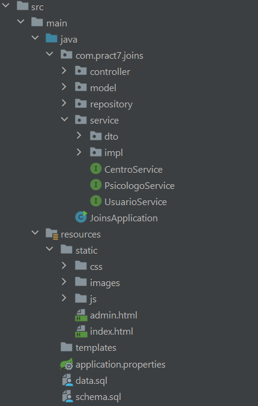
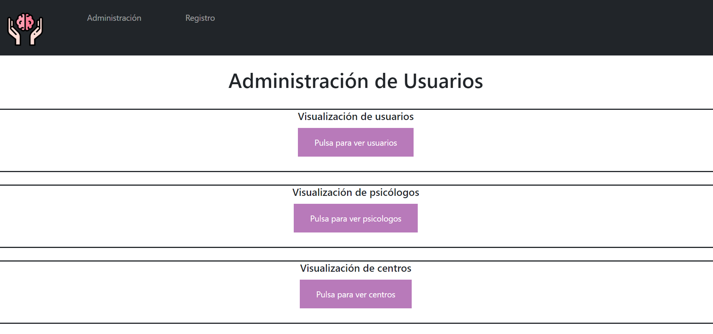
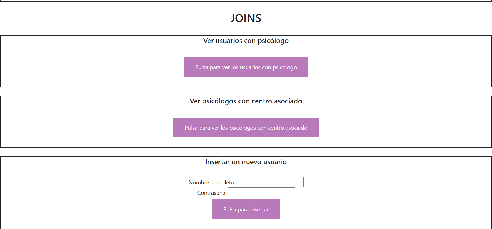

# PRÁCTICA 7 - PAT
## Claudia Blanco 3ºA GITT
######  Persistencia con Queries

Se ha desarrollado una aplicación de Spring Boot que permite persistir información utilizando la librería Spring Data 
JDBC con una base de datos H2. 

La base de datos está formada por tres tablas: USUARIOS, PSICOLOGOS y CENTROS.

La estructura de paquetes del proyecto es la siguiente:

Se han incluido dos JOINS:
1. Selección de usuarios que tienen psicólogo
2. Selección de psicólogos asociados a algún centro médico

La primera se ha hecho utilizando el método query de JDBCTemplate (al igual que el resto de queries de la práctica) en
la clase UsuarioServiceImpl. 
La segunda se ha hecho utilizando la anotación @Query en la clase PsicologoRepository. 

A continuación se detallan algunas de las queries incluidas:
1. GET de todos los usuarios, de todos los psicólogos y de todos los centros
2. GET de los usuarios con psicólogo asociado
3. GET de los usuarios por ID
4. GET de los psicólogos por ID
5. GET de los pacientes de un psicólogo
6. GET de los psicólogos freelance
7. GET de los psicólogos asociados a un centro médico
8. PUT: actualización del psicólogo asociado de un usuario
9. DELETE: dar de baja a un psicólogo
10. DELETE: dar de baja a un usuario
11. POST: inserción de un nuevo usuario en la BBDD

Se incluye también un HTML en el que se utilizan algunos de estos métodos.

...

- Ver usuarios, psicólogos y centros
- Dar de baja a un psicólogo
- Cambiar el psicólogo de un usuario
- Ver usuarios con psicólogo
- Ver psicólogos con centro asociado
- Insertar usuarios (especificando nombre completo y contraseña; sin psicólogo asociado por defecto)
